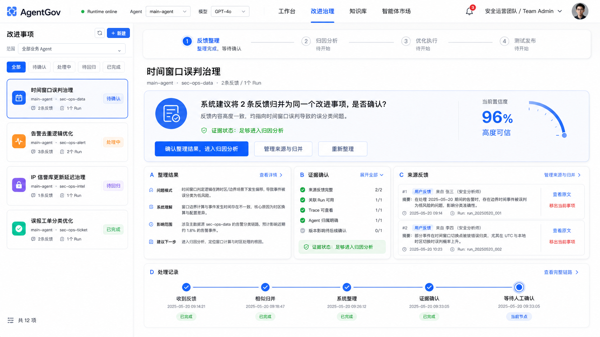
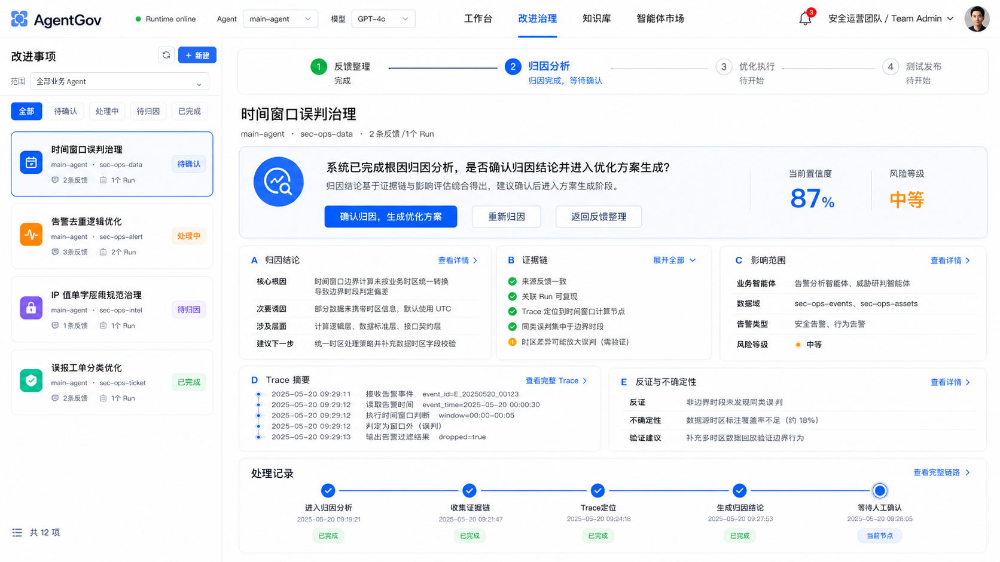
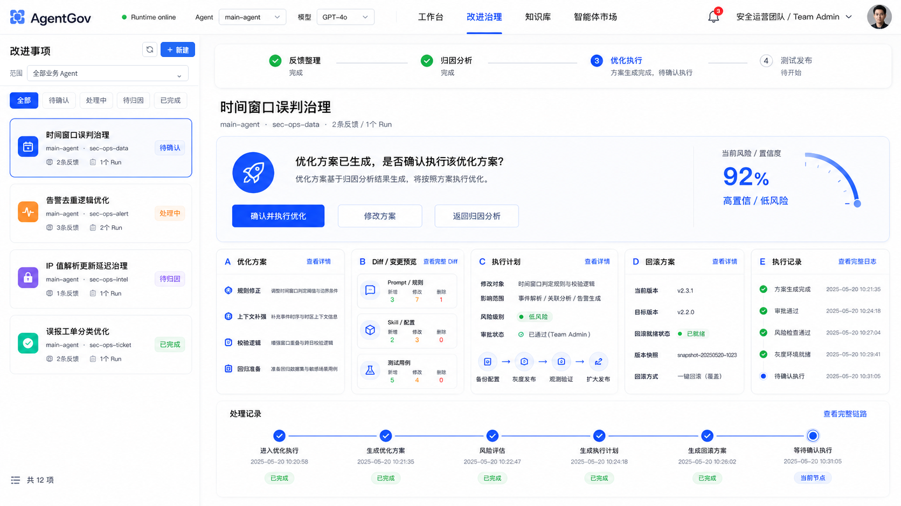
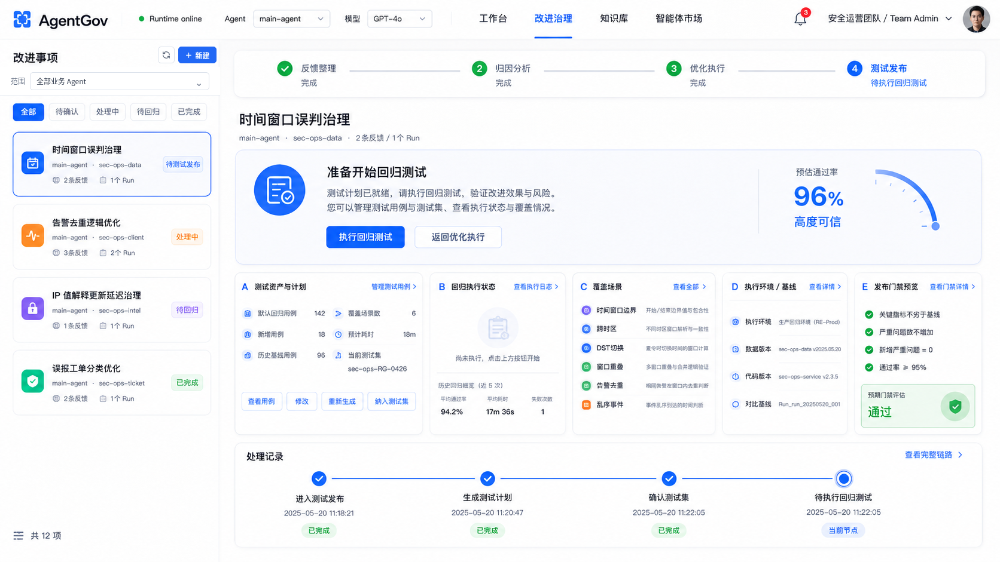

# AgentGov 四阶段改进治理工作台 UI 整改方案

> 文档层级：四阶段改进治理工作台 UI 与流程绝对权威。
> 权威范围：本文与四张效果图 `docs/imgs/反馈整理.png`、`docs/imgs/归因分析.png`、`docs/imgs/优化执行.png`、`docs/imgs/测试发布.png` 共同定义改进治理工作台的用户主链路、页面骨架、决策卡、面板入口、处理记录和验收锚点。
> 覆盖规则：凡已归档的旧 ASCII UI 草图、当前实现基线、旧设计评审、前端旧设计、后端旧设计或测试验收口径与本文冲突，以本文和四张效果图为准。
> 实施边界：当前前后端、OpenAPI、测试和文档共同实现本文契约；后续改动不得恢复已删除旧路径。
> 代码整改原则：实现默认按四阶段重构或重新设计。当重构收益更大时，不为旧七段阶段、旧反馈工作台四菜单、旧发布顶级入口或旧兼容 facade 增加迁移/兼容层，除非用户单独批准。

## 1. 文档目的

本文档用于说明 AgentGov 改进治理工作台的最终版 UI 方案，覆盖以下内容：

- 四阶段主链路定义
- 四个阶段各自的页面结构与交互规则
- 决策卡设计规范
- 面板级“查看详情 / 管理”入口规范
- 处理记录统一规范
- AI 友好与人类友好的兼容设计
- Workspace pytest 测试资产化与沉淀设计
- 四张效果图对应的页面含义说明

本方案聚焦解决以下问题：

1. 页面“信息堆叠”感过强；
2. 决策卡中按钮过多、查看类动作与流程动作混杂；
3. 摘要信息与详细信息缺少统一的下钻入口；
4. 各阶段底部“处理记录”不统一，且混杂了全链路信息；
5. 测试阶段对测试用例资产的治理入口不足。
6. 人类界面与 AI / Playwright / 测试数据自动化工具消费的上下文契约没有在权威方案中统一；
7. 测试设计、可执行测试文件、平台运行证据和发布条件曾被混成一个对象，无法与业务 Agent Workspace 同版本治理。

---

## 2. 最终主链路

系统主链路统一为四个阶段：

1. **反馈整理**
2. **归因分析**
3. **优化执行**
4. **测试发布**

对应的用户心智模型分别是：

- 反馈整理：整理反馈，接受当前问题对象后生成归因分析；
- 归因分析：查看根因，接受当前归因后生成优化方案；
- 优化执行：查看方案，接受当前方案后执行优化；
- 测试发布：生成可执行 pytest 代码候选、确认待发布变更、显式运行当前待发布版本，再决定是否发布。

这四个阶段作为顶部主链路固定呈现，形成统一的流程感和闭环感。

---

## 3. 整体页面骨架

四个阶段统一使用同一套工作台骨架：

### 3.1 左侧：改进事项队列

用于展示当前可处理的改进事项集合。

包含：
- 标题栏：左侧固定为“改进事项”，右侧依次放置仅图标的“刷新”和带 `+` 图标的“新建”按钮；刷新图标必须提供可访问名称和悬停提示
- 范围筛选：只保留一个带“范围”标签的业务 Agent 下拉框；下拉框选项本身已表达“全部业务 Agent”或具体 Agent，右侧不得再次重复同一文本
- 快捷筛选：全部 / 待确认 / 处理中 / 待归因（或待回归）/ 已完成
- 列表项：
  - 事项标题
  - 所属 Agent / 数据域
  - 反馈数 / Run 数
  - 当前状态标签

新建表单不得常驻列表底部。点击标题栏“新建”后打开独立窄抽屉，抽屉包含归属业务 Agent、改进事项标题、取消和新建动作：

- 默认归属优先使用当前改进事项范围，其次使用顶栏当前业务 Agent，最后回退到第一个可用业务 Agent；
- 用户可在抽屉中切换归属业务 Agent，按 `Enter` 与点击“新建”等价；
- 提交期间禁用关闭和重复提交；失败详情留在抽屉内，不污染列表的加载错误；
- 创建成功后关闭抽屉、把状态筛选切回“全部”并选中新事项。当前为“全部业务 Agent”时继续保持全量范围；当前为其他业务 Agent 且与新事项归属不同时，切换到新事项归属，确保新事项立即可见；
- 没有可用业务 Agent 时保留抽屉空态并禁用提交，不显示无效的空下拉选择。

### 3.2 右侧：当前改进事项工作台

统一由五层结构构成：

1. 顶部阶段进度条
2. 页面标题与元信息
3. **决策卡（当前阶段唯一主决策中心）**
4. 阶段工作面板（摘要、证据、详情、计划、资产）
5. 底部处理记录（只展示本阶段）

四张效果图统一展示新建抽屉关闭时的工作台；标题栏“新建”是抽屉唯一入口，图中不再出现列表底部内嵌新建表单。

---

## 4. 决策卡设计规范（最终版）

### 4.1 核心原则

决策卡只负责回答一个问题：

> **当前阶段，用户需要做什么决定？**

它不承担查看详情、展开明细、浏览证据全文等职责。决策卡主按钮必须执行真实业务动作；内部阶段推进只能作为该业务动作的副作用，不能成为主按钮唯一效果。

### 4.2 决策卡允许出现的按钮类型

#### A. 主决策按钮
例如：
- 生成归因分析
- 生成优化方案
- 执行优化
- 生成回归测试

主按钮点击即表示用户接受当前阶段已展示的前置事实。例如点击“生成归因分析”表示接受当前反馈范围和系统理解；点击“生成优化方案”表示接受当前归因结论。确认记录由后端确认端点或审计事件承载，不再设计成阻断主流程的独立主按钮。

#### B. 改变流程方向的按钮
例如：
- 重新整理
- 重新归因
- 返回反馈整理
- 返回归因分析
- 返回优化执行

#### C. 改变输入事实或结论的按钮
例如：
- 管理来源与归并
- 修改方案

### 4.3 不再放在决策卡中的按钮
以下按钮统一从决策卡下沉至面板：

- 查看证据
- 查看 Trace
- 查看完整归因
- 查看方案
- 查看 Diff
- 查看执行计划
- 查看测试计划
- 查看测试结果
- 查看日志

### 4.4 最终结构原则

> **决策卡瘦身，面板补入口，抽屉承载完整信息。**

---

## 5. 面板动作规范（最终版新增）

为了在不污染决策卡的前提下保留完整的信息可钻取能力，所有主面板统一采用“标题 + 右侧动作”的模式。

### 5.1 动作类型（四阶段改进治理 W3 修订：4 类 → 2 类）

> **W3 修订决策（2.8.5）**：原 4 类标签（查看详情 / 管理 / 查看完整内容 / 展开全部）收敛为 **2 类**。依据：「查看完整内容」「展开全部」本质都是只读下钻，与「查看详情」无用户可感知差异，统一为「查看详情」；只有会改变对象关系或资产内容的面板才用「管理」。原 4 类的脚手架实现存在 14 个未接线的死按钮 + 内容与卡片不对应，W3 一并整改为：只读卡统一进 `StageDetailDrawer`（内容与本卡一一对应），可编辑卡进对应管理抽屉。

#### 1）查看详情（所有只读下钻）
点击在面板标题右上角，统一打开 `StageDetailDrawer`，抽屉内容与本面板语义一一对应。适用：整理结果、证据确认、归因结论、影响范围、证据链、Trace 摘要、反证与不确定性、优化方案、Diff / 变更预览、执行计划、回滚方案、执行记录、回归测试代码候选、Workspace 测试文件、测试代码详情、版本范围和发布条件建议。

#### 2）管理（可编辑）
适用于会改变对象关系或资产内容的面板，打开对应管理抽屉。当前适用：来源反馈。测试文件由“确认待发布变更”业务动作确定性写入 Workspace，不提供通用内容管理抽屉。

### 5.2 位置规范

所有这些入口统一放在：

> **面板标题右上角**

而不是重新放回决策卡。

---

## 6. 处理记录统一规范（本次重点整改）

这是本版方案的一个关键新增规范。

### 6.1 原则

每个阶段页面中的“处理记录”必须：

1. **统一名称**：统一叫“处理记录”；
2. **统一位置**：统一位于页面底部；
3. **统一样式**：统一采用横向时间线样式；
4. **统一粒度**：统一展示 4～6 个本阶段关键节点；
5. **统一职责**：**默认只展示本阶段处理记录**；
6. **统一入口**：右上角统一提供“查看完整链路”。

### 6.2 为什么只展示本阶段

阶段页底部处理记录的作用是：

> 告诉用户“当前这个阶段，是怎么推进到现在的”。

它不是全链路历史回放，不应该把前后所有阶段的节点都堆在一起。

### 6.3 全链路记录如何处理

全链路信息仍然需要，但不与本阶段 Timeline 混用。

方案为：
- 顶部阶段条负责展示全局进度；
- 底部处理记录只展示本阶段；
- “查看完整链路”进入抽屉或独立页，查看完整生命周期。

### 6.4 四个阶段的处理记录节点建议

#### 反馈整理阶段
- 收到反馈
- 相似归并
- 系统整理
- 证据确认
- 等待生成归因分析

#### 归因分析阶段
- 生成归因分析
- 收集证据链
- Trace 定位
- 生成归因结论
- 等待生成优化方案

#### 优化执行阶段
- 进入优化执行
- 生成优化方案
- 风险评估
- 生成执行计划
- 生成回滚方案
- 等待确认执行

#### 测试发布阶段
- 进入测试发布
- 生成测试计划
- 确认测试集
- 待执行回归测试

### 6.5 状态词统一

时间线节点状态统一使用：
- 已完成
- 当前节点
- 进行中
- 失败
- 已回退
- 已跳过

本轮效果图以“已完成 / 当前节点”为主。

---

## 7. 阶段一：反馈整理

效果图：

### 7.1 阶段目标
将多条反馈整理为一个可治理的问题对象，完成系统整理、问题理解与证据确认，并由人工决定是否基于当前整理结果生成归因分析。

### 7.2 当前图对应状态
**整理完成，等待生成归因**

### 7.3 决策卡按钮
- **生成归因分析**
- 管理来源与归并
- 重新整理

### 7.4 主要面板

#### A. 整理结果（查看详情）
展示摘要：
- 问题模式
- 系统理解
- 影响范围
- 建议下一步

点击“查看详情”后进入抽屉，查看完整整理结果、相似归并依据、人工备注等。

#### B. 证据确认（展开全部）
Checklist 形式展示：
- 来源反馈完整
- 关联 Run 可用
- Trace 可查看
- Agent 归属明确
- 版本影响待后续确认

#### C. 来源反馈（管理来源与归并）
展示来源反馈列表，并支持：
- 查看原文
- 移出当前事项
- 添加 / 调整归并关系（进入管理抽屉）

#### D. 处理记录
只展示反馈整理阶段的本地时间线。

---

## 8. 阶段二：归因分析

效果图：

### 8.1 阶段目标
基于前阶段确认的问题对象与证据，分析根因、影响范围和不确定性，并决定是否进入优化方案生成。

### 8.2 当前图对应状态
**归因完成，等待生成方案**

### 8.3 决策卡按钮
- **生成优化方案**
- 重新归因
- 返回反馈整理

### 8.4 主要面板

#### A. 归因结论（查看详情）
展示摘要：
- 核心根因
- 次要诱因
- 涉及层面
- 建议下一步

点击“查看详情”进入归因结论抽屉，查看完整归因报告。

#### B. 证据链（展开全部）
展示支撑归因的关键证据项。

#### C. 影响范围（查看详情）
展示：
- 业务智能体
- 数据域
- 告警类型
- 风险等级

#### D. Trace 摘要（查看完整 Trace）
展示关键运行链路节点及简要结果。

#### E. 反证与不确定性（查看详情）
展示：
- 反证
- 不确定性
- 验证建议

#### F. 处理记录
只展示归因分析阶段本地时间线。

---

## 9. 阶段三：优化执行

效果图：

### 9.1 阶段目标
根据归因结论生成优化方案，展示变更内容、执行计划与回滚方案，并由人工决定是否执行。

### 9.2 当前图对应状态
**方案生成完成，待执行优化**

### 9.3 决策卡按钮
- **自动执行优化**
- 修改方案
- 返回归因分析

### 9.4 主要面板

#### A. 优化方案（查看详情）
展示摘要：
- 规则修正
- 上下文补强
- 校验逻辑
- 回归准备

> 注意：面板标题不再叫“优化方案摘要”，而是直接叫“优化方案”。

#### B. Diff / 变更预览（查看完整 Diff）
展示：
- Prompt / 规则 变更量
- Skill / 配置 变更量
- 测试用例 变更量

#### C. 执行计划（查看详情）
展示：
- 修改对象
- 影响范围
- 风险级别
- 审批状态
- 执行步骤

#### D. 回滚方案（查看详情）
展示：
- 当前版本
- 目标版本
- 回滚就绪状态
- 版本快照
- 回滚方式

#### E. 执行记录（查看完整日志）
展示方案生成、审批、风险检查、环境就绪等关键执行前状态。

#### F. 处理记录
只展示优化执行阶段本地时间线。

### 9.5 执行范围与内容保真

- 已确认的优化方案目标是本次执行可写范围，执行任务不得读取全 Workspace 后自行扩大修改面；
- 规范化反馈明确“仅修改 `CLAUDE.md`”时，Skill、settings、MCP 和其他文件都不得进入执行 Diff；
- 已有 Markdown 的整文件替换若保留不足一半原有非空行，后端必须拒绝，防止完整规则被短片段覆盖；
- 上述检查是确定性后端硬门，完整 Diff 仍由开发者在执行与发布前审查。

---

## 10. 阶段四：测试发布

效果图：

### 10.1 阶段目标

把治理 Agent 生成的回归测试代码候选沉淀为业务 Agent Workspace 中可执行、可版本化的 pytest 文件，并使用平台固定命令验证当前待发布版本。测试结果与发布条件必须绑定同一精确 Git 提交。

### 10.2 当前图对应状态

**待生成回归测试 / 待确认待发布变更 / 待运行测试 / 平台测试运行中 / 待发布**。页面按真实状态显示其中一个，不把代码生成或变更确认误写成测试通过。

### 10.3 决策卡按钮

- 尚无代码候选时：**生成回归测试**
- 需要返工时：返回优化执行
- 查看测试文件、平台运行、日志和发布条件属于面板或发布抽屉动作，不进入决策卡

“确认待发布变更”是“回归测试代码候选”面板内的业务动作。确认后，后端在同一隔离 worktree 中新增测试文件，并把配置修改和测试文件提交为相对修复前版本的同一个待发布 commit；不会自动创建平台测试运行。运行测试由发布工作台中的独立显式动作触发。

### 10.4 主要面板

#### A. 回归测试代码候选（查看详情）

展示：

- 归属业务 Agent
- 来源改进事项
- 候选状态
- 修复前版本
- 待发布版本
- 候选测试文件数与反馈来源数

用户可以“确认待发布变更”。该动作只确认当前代码候选并触发确定性物化与单提交收口，不允许客户端提交文件路径、提交 SHA、pytest 命令或运行结果，也不隐式运行 pytest。

#### B. 测试文件（查看详情）

展示当前事项已经写入待发布版本的 `tests/test_*.py`。`workspace/tests/` 是可执行测试资产唯一真相源；没有数据库测试集、临时勾选集合或通用 Asset body 副本。

#### C. 测试用例详情（查看详情）

展示后端确定的目标路径、完整 pytest 代码、测试意图和断言依据。它用于用户审查可执行测试语义；真正的通过/失败只来自已确认待发布 commit 上完整 `tests/` 的 pytest 运行。

#### D. 版本范围（查看详情）

只使用明确标签：

- 修复前版本
- 待发布版本

代码和 API 可以保留 `base_commit_sha`、`candidate_commit_sha` 字段，但用户界面只显示“修复前版本”“待发布版本”。

#### E. 发布条件建议（查看详情）

展示治理 Agent 建议的阈值与风险重点，并明确标注“仅作设计建议”。实际普通发布条件只接受同一业务 Agent、当前待发布 `commit_sha` 上状态为 `passed` 的平台测试运行。

### 10.5 平台测试运行与发布抽屉

发布抽屉统一展示：

- 当前待发布版本的测试目录、文件数、派生 `suite_digest` 和诊断；
- 最新平台测试运行状态、固定命令、stdout、stderr、pytest item 和错误详情；
- 运行、取消、重试入口；
- 修复前版本、待发布版本、Diff、发布阻塞原因和历史发布记录；
- 普通发布入口；
- 历史强制发布记录的原阻塞项、原因、操作人和持久化警告。

旧提交通过、空测试目录、失败、错误、取消或服务重启导致的 `interrupted` 都不能满足发布条件。变更返工后产生新待发布提交时，必须重新运行该提交的完整 `workspace/tests/`。反馈闭环待发布版本不提供强制发布入口，也不能通过 API 强制绕过测试条件。

### 10.6 处理记录

只展示测试发布阶段本地时间线：

- 进入测试发布
- 生成回归测试
- 确认待发布变更
- 用户显式运行测试
- 测试通过、失败、取消或中断
- 发布或返回优化执行
## 11. 四张效果图路径（本次最新版）

1. **反馈整理阶段**
   - `docs/imgs/反馈整理.png`

2. **归因分析阶段**
   - `docs/imgs/归因分析.png`

3. **优化执行阶段**
   - `docs/imgs/优化执行.png`

4. **测试发布阶段**
   - `docs/imgs/测试发布.png`

---

## 12. AI 友好与人类友好兼容设计

改进治理工作台必须同时服务两类消费者：

1. **人类用户**：开发者、治理负责人、测试负责人需要低负担判断“当前阶段要做什么决定”。
2. **AI / 自动化工具**：Codex、Claude Code、Playwright、测试数据自动化工具和治理 Agent 需要稳定、完整、可复现的结构化上下文。

两类消费者使用同一事实源，但不能混用同一展示方式。

### 12.1 人类友好层

人类友好层只展示当前阶段决策所需的信息：

- 顶部阶段条展示全局进度；
- 决策卡只保留当前主决策、方向改变和事实修正动作；
- 中部面板展示摘要、证据、计划、资产和详情入口；
- 底部处理记录只展示本阶段推进过程；
- 完整链路、Trace、Diff、日志、完整测试报告进入抽屉或二级视图。

人类界面不得把底层 job id、raw JSON、完整 Trace、自动化日志、模型原始输出、Playwright selector 和数据库字段直接堆在主界面。

### 12.2 AI 友好层

AI 友好层通过“获取上下文”提供结构化导出，不通过扩大主界面信息密度实现。

“获取上下文”入口出现在：

- 页面标题区域；
- 决策卡右侧辅助区；
- 关键面板标题右上角；
- 回归失败、发布阻塞、证据不足等需要交给 AI 继续分析的位置。

上下文类型统一为四类：

| 类型 | 消费者 | 内容形态 | 用途 |
| --- | --- | --- | --- |
| 问题摘要 | 人类、Issue、PR、群聊 | Markdown | 让人快速理解当前事项和阻塞点 |
| AI 分析上下文 | Codex、Claude Code、ChatGPT、治理 Agent | Markdown + 稳定字段 | 继续分析归因、方案、风险、测试缺口 |
| Playwright 复现信息 | 自动化测试、AI 生成测试 | 路径 + 状态 + 断言 + selector | 生成或修复 UI 验收脚本 |
| 完整 JSON 上下文 | Agent、测试数据自动化工具、调试工具 | 结构化 JSON | 跨工具稳定消费、审计和复现 |

### 12.3 ContextPackage 最小字段

完整 JSON 上下文必须至少包含：

```text
context_version
source.page
source.url
source.timestamp
improvement.improvement_id
improvement.title
improvement.stage
improvement.status
improvement.agent_id
current_decision.primary_action
current_decision.allowed_actions
source_feedback[]
normalized_feedback
attribution
optimization_plan
execution_record
regression_test_design
workspace_tests.files[]
workspace_tests.candidate_commit_sha
workspace_tests.test_run
release_gate_preview
evidence_refs[]
trace_refs[]
asset_refs[]
missing_reasons[]
```

字段缺失时输出 `missing_reasons[]`，不得用空对象冒充完整证据。

### 12.4 同源约束

AI 友好层与人类友好层必须同源：

- 页面显示的阶段、主动作、面板摘要和 ContextPackage 中的阶段、主动作、摘要一致；
- API、DTO、ContextPackage、Playwright selector 和 UI 文案使用同一术语表；
- AI 导出可以更完整，但不能引入 UI 中不存在的事实结论；
- AI 导出可以暴露稳定 ID，但人类主界面默认显示标题、状态和摘要；
- Playwright 断言必须包含负向断言，例如“查看类动作不出现在决策卡中”“完整 Trace 不出现在主界面”。

### 12.5 边界

“AI 友好”不等于把页面做成调试控制台，也不等于让 AI 直接跳过人工确认。

默认边界为：

- AI 可以消费上下文、生成分析、提出方案、生成测试候选和复现脚本；
- 后端规则和状态机负责校验合法转移、权限、发布条件和资产写入；
- 人类保留归因确认、方案执行、回归测试和发布相关关键决策；
- 高风险动作不得只因 AI 输出存在而自动推进。

---

## 13. Workspace pytest 测试资产化与沉淀设计

测试发布阶段不维护脱离业务 Agent 的测试内容数据库。测试必须和被测 Agent 的 prompt、skill、hook、MCP 配置及代码一起开发、评审、导入、导出和发布。

### 13.1 核心对象

| 对象 | 定位 | 权威来源 |
| --- | --- | --- |
| `RegressionTestDesign` | 治理 Agent 给出的测试语义候选 | 事项内容子资源 |
| Workspace 测试文件 | 可执行 pytest 测试资产 | 精确 Git commit 中的 `tests/test_*.py` |
| `AgentTestSuiteSummary` | 指定提交测试目录、文件、诊断和摘要的派生视图 | 运行时扫描，不单独保存测试正文 |
| `AgentTestRun` | 平台固定命令的一次执行证据 | SQLite 运行记录 + pytest 输出 |
| `AgentTestSchedule` / `AgentTestScheduleEvent` | 每 Agent 定时策略及触发审计 | SQLite 调度记录，不保存测试正文 |
| `AgentChangeSet` | 同一未发布改动的业务关联 | 后端版本治理记录 |
| `Release` | 发布、强制发布警告、恢复和回滚事实 | 后端发布记录 |

确认后的测试可执行正文只存在于 Workspace Git。确认前的回归测试代码候选是待审查 Diff，不是测试运行结果或第二套长期资产；`AgentTestRun` 不复制测试源码，Asset Registry 也不保存另一份测试 body。

### 13.2 Workspace 目录契约

```text
workspace/
├── CLAUDE.md
├── .claude/
├── .mcp.json
└── tests/
    ├── README.md
    ├── conftest.py       # 可选
    └── test_*.py
```

- 首版只接受 `tests/` 下的扁平 Python 文件；
- `tests/test_*.py` 必须可被 Python 解析；
- 测试依赖、fixture 和人工复核边界由 `tests/README.md` 说明；
- 测试与 Agent Workspace 同 commit、同 Diff、同导入包和同发布版本；
- 所有注册业务 Agent（含 `main-agent`）遵循相同结构；
- governor 可使用项目测试目录验证自身，但不进入业务 Agent 注册表和发布链。

### 13.3 从代码候选到可执行测试

该流程固定为三个独立业务动作：

1. **生成回归测试**：治理 Agent 只输出完整 pytest 代码、测试意图和断言依据；后端确定
   `tests/test_feedback_<id>_<digest>.py` 路径并校验代码。结果展示为完整新增文件 Diff，不写入
   Workspace、不提交 Git、不运行测试；生成失败时不得用启发式逻辑伪造测试。代码必须先直接断言
   `assert not result.errors`，再对明确业务结果分别断言；`errors` 是 tuple，不能与空 list 比较。
   固定业务词先用 `normalized_text = "".join(result.text.split())` 消除 Markdown 空格/换行差异再断言，但不得放宽业务语义。
   反馈整理和优化方案中每个独立可观察的修复结果都必须有单独正向断言，不得只写入测试意图或断言依据。
   自包含业务事实用例还必须禁止外部工具/文件取证，并对 `agent_activity.tool_calls` 为空做可执行断言；不允许用恢复后最终回答掩盖大量失败工具尝试。
   仅检查非空、恒等比较、嵌套断言、辅助函数、`any(...)`、`A or B` 候选关键词，或只断言相反结果
   未出现而遗漏目标结果，均不构成有效回归测试。输入中已有判断事实时应直接内嵌，
   不得无依据地改写为依赖外部 MCP、数据库或网络数据的查询。
2. **确认待发布变更**：校验事项、业务 Agent、归因、优化方案、执行记录和待发布变更仍属于同一链路；
   在隔离 worktree 新增已确认测试文件，不覆盖、删除或弱化已有测试；将配置修改和测试文件压缩为
   相对修复前版本的单一待发布 Git commit。失败时恢复原待发布提交。
3. **运行测试**：用户在发布工作台显式触发后，平台 checkout 当前待发布 commit，运行完整 `tests/`
   并创建 `source=release_check` 的 `AgentTestRun`。确认动作不得隐式排队或执行测试。

同一待发布变更可以因返工产生更新的待发布提交。旧提交和旧运行继续可审计，但只允许当前待发布提交参与普通发布条件判断。

### 13.4 agentgov_testkit

开发者可以在 Workspace 测试中使用版本化 Python 包：

```python
from agentgov_testkit import invoke_agent


def test_expected_behavior():
    result = invoke_agent("输入一个业务问题")
    assert "预期业务结论" in result.text
```

也可以使用 pytest 的 `agent` fixture。testkit 在一个 pytest session 内只解析一次精确 commit，但为每个
测试函数创建并关闭独立 Agent 会话，避免历史消息和上下文窗口跨用例污染。testkit 封装被测 Agent 调用，
不引入必须由开发者理解的平行 Client 类。测试断言在 pytest 进程中执行，平台不接收客户端上传的通过状态。

### 13.5 平台固定执行

平台执行命令固定为：

```bash
python -m pytest -q -p agentgov_testkit.pytest_plugin tests
```

客户端不能提交命令、工作目录、安装步骤、状态或报告。第一阶段只在 API 容器的受控 worktree 中执行，不自动安装任意依赖，也不把导入动作等同于执行测试。

`AgentTestRun` 保存：

```text
test_run_id
agent_id
commit_sha
change_set_id          # 可选业务关联
schedule_id            # 定时触发时存在
scheduled_for          # 定时计划窗口
source
status
suite_digest           # 从该 commit 派生
command
stdout / stderr
pytest items / report
error
created_at / started_at / completed_at
```

### 13.6 版本身份

Git `commit_sha` 是被测版本的唯一权威标识。省略提交时，平台必须在创建测试会话或运行的请求内读取当前版本并固定一次；后续执行不能重新解释“最新”。

`suite_digest` 只校验该提交中的测试内容，`change_set_id` 只关联同一未发布改动。两者不能与 commit 拼接成新的复合身份，也不能覆盖 commit 事实。

用户界面统一显示“修复前版本”和“待发布版本”。`base_commit_sha`、`candidate_commit_sha` 作为代码字段保留，不改变用户展示口径。

### 13.7 运行生命周期与重启

```text
queued -> running -> passed | failed | error | cancelled
running --服务关闭或重启--> interrupted
```

- 尚未领取的 `queued` 运行在服务启动后重新入队；
- 遗留 `running` 明确收口为 `interrupted`；
- 取消请求持久化并终止整个 pytest 进程组；
- 临时测试会话不伪装为跨进程可恢复，重启后返回 session unavailable；
- stdout、stderr、item 和错误详情持久化且有大小上限。

### 13.8 发布条件

普通发布只接受当前待发布提交的通过证据：

- 同一业务 Agent；
- `AgentTestRun.commit_sha` 精确等于 `AgentChangeSet.candidate_commit_sha`；
- 运行状态为 `passed`；
- Workspace 在该提交上存在可运行测试；
- 归因和执行 provenance 完整。

旧提交通过、空测试目录、设计已确认但文件未生成、失败、错误、取消或中断都不能放行。平台固定运行当前待发布提交的完整 `workspace/tests/`，已有失败和新增失败都必须整改。反馈闭环待发布版本不能强制绕过测试条件；界面只保留历史强制发布记录的原阻塞项、操作人、原因和警告。未关联反馈、由版本治理 API 手工创建的待发布版本，其强制发布属于受保护例外且不出现在本工作台；provenance 不完整始终不可绕过。

### 13.9 导入、导出与远程开发

- 新建和覆盖导入都要求包根目录 `agent.yaml.agent.id` 有效，并与 URL 路径中的目标 `agent_id`
  逐字一致；缺失、无效、格式错误或来源 ID 冲突时明确拒绝，平台不改写身份；
- 导入此前不存在的 ID 会创建新业务 Agent；已有 ID 必须携带预期当前提交版本才能覆盖；
- 缺少 `tests/`、README 或测试文件时允许导入并返回结构化 warning；
- 开发者可在本地运行 pytest，通过 testkit 连接已导入 Agent；
- 平台远程接口负责调用精确版本的被测 Agent，不上传或反向执行开发者本地任意测试代码。

### 13.10 资产复利中心

一级导航“资产复利中心”包含两个页签，默认进入“测试资产”：“测试资产”只读投影 Workspace Git 与平台
运行/调度证据；“治理资产”继续管理方法论、执行和审计资产的沉淀与跨 Agent 继承。测试页不展示通用
资产的“沉淀新资产”“继承复用”动作，也不提供跨 Agent 自动复制测试代码。

测试资产按业务 Agent 展示文件数、当前有效 commit、suite digest/诊断、最近运行和定时状态。Agent 详情
固定分为：

1. **测试文件**：只允许读取当前 suite 中的 `tests/test_*.py`，以只读 Python 代码视图展示行号、搜索、
   复制和折叠；右侧符号轨道投影顶层 class/function 与 `Test*` 类的直接 `test_*` 方法，可预览并定位
   精确行号。正文仍只存在于 Workspace Git。
2. **运行历史**：轻量摘要分页并支持状态/来源筛选；点击后再加载 stdout、stderr、pytest item、
   invocation 和结构化错误。
3. **定时策略**：每 Agent 唯一，支持常用频率和自定义五字段 Cron、IANA 时区，最短间隔 15 分钟；
   保存配置不立即运行。

定时触发只读取触发时当前有效 commit，创建 `source=scheduled`、`change_set_id=null` 的运行；它不读取
待发布 worktree，也不推进待发布变更或 release。错过多个窗口时只补一次，同 Agent/commit 已有活跃
运行时合并并记录触发事件。测试与改进事项、待发布变更或 release 的 provenance 只有在持久化关联存在时
才展示，不从文件名猜测来源。

资产复利中心两个页签不再各自提供刷新按钮；Topbar“刷新”只刷新当前激活页签，隐藏页签不得产生请求。

### 13.11 已删除设计

数据库测试集、全局用例池、数据集生命周期、逐 case review 和独立评估运行链已经从活跃代码、API 和 UI 删除。历史 migration 与归档材料可保留旧名称用于升级和审计，但不得形成兼容入口。

### 13.12 验收断言

- 每个被测版本都由精确 `commit_sha` 标识；
- 测试文件只从该提交的 `tests/` 读取；
- 导入缺测试只告警，普通发布则被门禁阻断；
- 客户端不能覆盖固定命令、运行状态和报告；
- 生成只形成完整代码 Diff，确认只形成配置与测试同一待发布 commit，运行测试由独立显式动作触发；
- 旧提交通过不能放行新提交；
- 服务重启后 running/queued/session 三类状态均有明确处理；
- 桌面、平板和移动端均能查看设计、测试文件、运行状态、错误详情和发布阻塞原因。

## 14. 代码实现原则

当前实现及后续演进必须遵守以下原则：

1. **用户主链路只保留四阶段**：反馈整理、归因分析、优化执行、测试发布是改进治理工作台唯一用户可见阶段。后端更细状态若仍存在，只能作为内部实现细节，不能反向决定页面结构。
2. **决策卡只承载当前主决策**：查看 Trace、查看 Diff、查看测试计划、查看日志等浏览动作必须下沉到面板入口或抽屉，不回到决策卡。
3. **测试发布阶段收口测试资产与发布条件**：回归测试设计、Workspace 测试文件、平台测试运行、版本范围和发布条件都归入测试发布阶段，不再用旧“回归资产”独立主路径定义改进治理主流程。
4. **旧设计不作为兼容目标**：旧七段链路、旧 `反馈信息 | 优化批次 | 回归资产 | 版本管理` 菜单、旧发布顶级入口、旧 proposal/job 页面和旧 facade 只可作为迁移来源或历史证据；若与四阶段方案冲突，默认删除、合并或重构，不默认保留兼容。
5. **接口与测试围绕四阶段验收**：后续 API、DTO、前端状态、Playwright 选择器和主流程测试应验证四阶段语义、面板入口和负向断言，例如“查看类按钮不出现在决策卡中”“处理记录只展示本阶段”“完整链路必须通过单独入口查看”。
6. **效果图是 UI parity 基准**：布局、命名、入口位置和信息归属以四张效果图为截图级验收锚点；旧草图、旧评审截图或当前运行态截图不能覆盖它们。
7. **AI / 人类双友好同源**：人类主界面保持低噪声，AI / Playwright / 测试自动化工具通过 ContextPackage 获取完整结构化上下文；两者必须来自同一事实源。
8. **测试与 Workspace 同版本**：`tests/` 是可执行测试资产唯一真相源，平台只派生 suite 摘要并保存运行证据，不建立第二套测试正文。
9. **列表工具动作集中到标题栏**：刷新和新建只出现在改进事项标题栏；新建使用独立窄抽屉，旧列表底部内嵌表单不得保留为兼容入口。
10. **筛选结果不重复复述**：业务 Agent 范围由带标签的单一下拉框完整表达，不在相邻位置再次渲染“全部业务 Agent”或当前 Agent 名称。

---

## 15. 最终结论

本次最终版方案，完成了七个关键升级：

1. **主链路收敛为四阶段**：反馈整理 → 归因分析 → 优化执行 → 测试发布。
2. **决策卡彻底瘦身**：只保留流程动作，不再承载查看类按钮。
3. **面板补齐入口**：摘要由面板展示，完整信息通过“查看详情 / 管理 / 查看完整”进入抽屉或二级视图。
4. **处理记录彻底统一**：四个阶段统一样式，并且默认只展示本阶段处理记录；全链路通过单独入口查看。
5. **AI 友好与人类友好同源兼容**：主界面服务人类决策，ContextPackage 服务 AI、Playwright 和自动化工具消费。
6. **Workspace pytest 资产化**：测试文件与业务 Agent 同版本，平台运行与当前待发布提交精确绑定，并通过 Registry 投影关系而不复制测试正文。
7. **列表操作收口**：刷新与新建集中在标题栏，新建进入独立窄抽屉，范围选择不再重复复述当前选项。

因此，整个系统的阅读路径被统一为：

> **顶部阶段条看全局 → 决策卡做当前判断 → 中部面板看摘要与详情入口 → 底部处理记录看本阶段推进过程。**

这就是最终推荐的 AgentGov 四阶段改进治理工作台 UI 设计方案。
