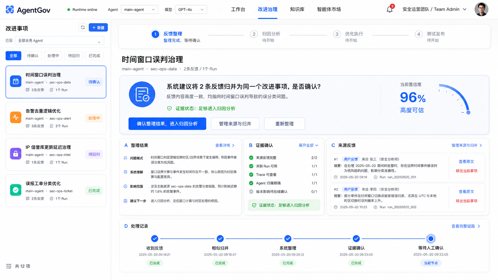
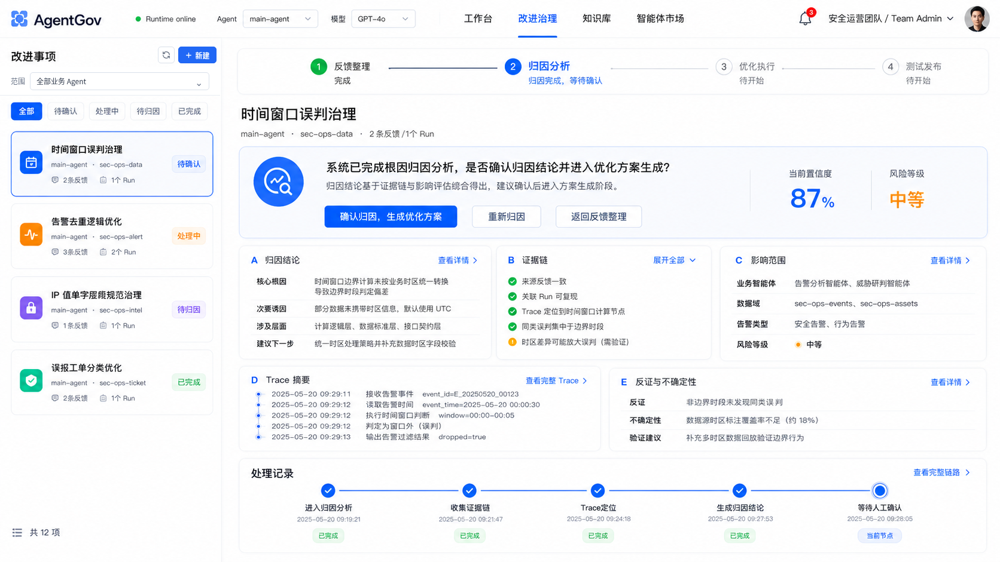
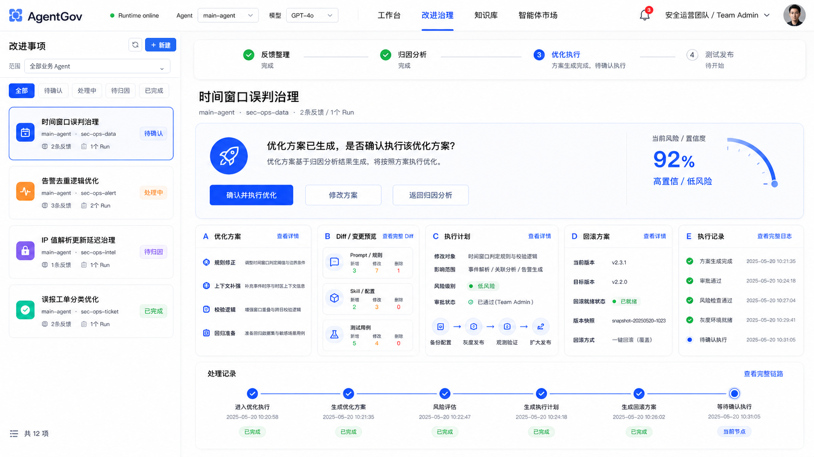
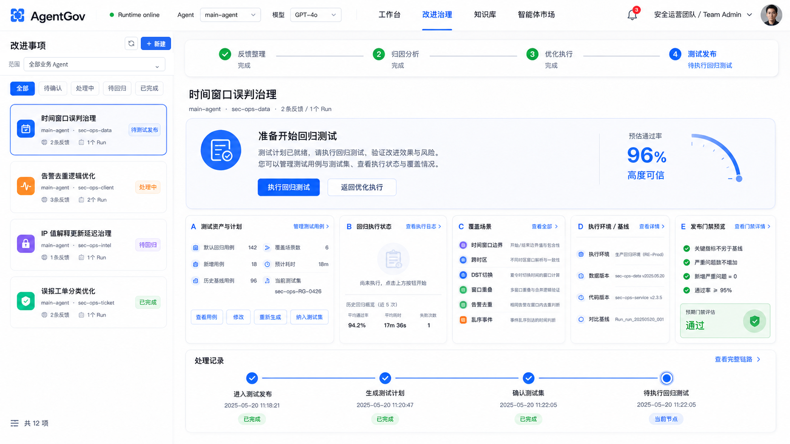

# AgentGov 四阶段改进治理工作台 UI 整改方案

> 文档层级：四阶段改进治理工作台 UI 与用户流程权威；不覆盖 OpenAPI、测试执行协议或里程碑状态。
> 权威范围：本文与四张效果图 `docs/imgs/反馈整理.png`、`docs/imgs/归因分析.png`、`docs/imgs/优化执行.png`、`docs/imgs/测试发布.png` 共同定义改进治理工作台的用户主链路、页面骨架、决策卡、面板入口、处理记录和验收锚点。
> 覆盖规则：已归档的旧 ASCII UI 草图、旧设计评审和旧用户流程若与本文冲突，以本文和四张效果图
> 为目标 UI 依据。本文不能覆盖当前实现基线、运行时 OpenAPI、测试执行协议或里程碑状态；这些
> 事实仍由各自权威来源维护。
> 实施边界：目标态实施时，前后端、OpenAPI、测试和文档必须共同实现本文契约；当前完成度以
> [反馈闭环当前实现基线](./反馈闭环当前实现基线.md)、运行时 OpenAPI 和真实运行态为准。后续改动
> 不得恢复已删除旧路径。
> 代码整改原则：实现默认按四阶段重构或重新设计。当重构收益更大时，不为旧七段阶段、旧反馈工作台四菜单、旧发布顶级入口或旧兼容 facade 增加迁移/兼容层，除非用户单独批准。

## 1. 文档目的

本文档用于说明 AgentGov 改进治理工作台的最终版 UI 方案，覆盖以下内容：

- 四阶段主链路定义
- 四个阶段各自的页面结构与交互规则
- 决策卡设计规范
- 面板级“查看详情 / 管理”入口规范
- 处理记录统一规范
- AI 友好与人类友好的兼容设计
- Workspace pytest 测试资产化与沉淀设计
- 四张效果图对应的页面含义说明

本方案聚焦解决以下问题：

1. 页面“信息堆叠”感过强；
2. 决策卡中按钮过多、查看类动作与流程动作混杂；
3. 摘要信息与详细信息缺少统一的下钻入口；
4. 各阶段底部“处理记录”不统一，且混杂了全链路信息；
5. 测试阶段对测试用例资产的治理入口不足。
6. 人类界面与 AI / Playwright / 测试数据自动化工具消费的上下文契约没有在权威方案中统一；
7. 测试设计、可执行测试文件、平台运行证据和发布条件曾被混成一个对象，无法与业务 Agent Workspace 同版本治理。

---

## 2. 最终主链路

系统主链路统一为四个阶段：

1. **反馈整理**
2. **归因分析**
3. **优化执行**
4. **测试发布**

对应的用户心智模型分别是：

- 反馈整理：整理反馈，接受当前问题对象后生成归因分析；
- 归因分析：查看根因，接受当前归因后生成优化方案；
- 优化执行：查看方案，接受当前方案后执行优化；
- 测试发布：生成可执行 pytest 代码候选、确认待发布变更、显式运行当前待发布版本，再决定是否发布。

这四个阶段作为顶部主链路固定呈现，形成统一的流程感和闭环感。

---

## 3. 整体页面骨架

四个阶段统一使用同一套工作台骨架：

### 3.1 左侧：改进事项队列

用于展示当前可处理的改进事项集合。

包含：
- 标题栏：左侧固定为“改进事项”，右侧依次放置仅图标的“刷新”和带 `+` 图标的“新建”按钮；刷新图标必须提供可访问名称和悬停提示
- 范围筛选：只保留一个带“范围”标签的业务 Agent 下拉框；下拉框选项本身已表达“全部业务 Agent”或具体 Agent，右侧不得再次重复同一文本
- 快捷筛选：全部 / 待确认 / 处理中 / 待归因（或待回归）/ 已完成
- 列表项：
  - 事项标题
  - 所属 Agent / 数据域
  - 反馈数 / Run 数
  - 当前状态标签

新建表单不得常驻列表底部。点击标题栏“新建”后打开独立窄抽屉，抽屉包含归属业务 Agent、改进事项标题、取消和新建动作：

- 默认归属优先使用当前改进事项范围，其次使用顶栏当前业务 Agent，最后回退到第一个可用业务 Agent；
- 用户可在抽屉中切换归属业务 Agent，按 `Enter` 与点击“新建”等价；
- 提交期间禁用关闭和重复提交；失败详情留在抽屉内，不污染列表的加载错误；
- 创建成功后关闭抽屉、把状态筛选切回“全部”并选中新事项。当前为“全部业务 Agent”时继续保持全量范围；当前为其他业务 Agent 且与新事项归属不同时，切换到新事项归属，确保新事项立即可见；
- 没有可用业务 Agent 时保留抽屉空态并禁用提交，不显示无效的空下拉选择。

### 3.2 右侧：当前改进事项工作台

统一由五层结构构成：

1. 顶部阶段进度条
2. 页面标题与元信息
3. **决策卡（当前阶段唯一主决策中心）**
4. 阶段工作面板（摘要、证据、详情、计划、资产）
5. 底部处理记录（只展示本阶段）

四张效果图统一展示新建抽屉关闭时的工作台；标题栏“新建”是抽屉唯一入口，图中不再出现列表底部内嵌新建表单。

---

## 4. 决策卡设计规范（最终版）

### 4.1 核心原则

决策卡只负责回答一个问题：

> **当前阶段，用户需要做什么决定？**

它不承担查看详情、展开明细、浏览证据全文等职责。决策卡主按钮必须执行真实业务动作；内部阶段推进只能作为该业务动作的副作用，不能成为主按钮唯一效果。

### 4.2 决策卡允许出现的按钮类型

#### A. 主决策按钮
例如：
- 生成归因分析
- 生成优化方案
- 执行优化
- 生成回归测试

主按钮点击即表示用户接受当前阶段已展示的前置事实。例如点击“生成归因分析”表示接受当前反馈范围和系统理解；点击“生成优化方案”表示接受当前归因结论。确认记录由后端确认端点或审计事件承载，不再设计成阻断主流程的独立主按钮。

#### B. 改变流程方向的按钮
例如：
- 重新整理
- 重新归因
- 返回反馈整理
- 返回归因分析
- 返回优化执行

#### C. 改变输入事实或结论的按钮
例如：
- 管理来源与归并
- 修改方案

### 4.3 不再放在决策卡中的按钮
以下按钮统一从决策卡下沉至面板：

- 查看证据
- 查看 Trace
- 查看完整归因
- 查看方案
- 查看 Diff
- 查看执行计划
- 查看测试计划
- 查看测试结果
- 查看日志

### 4.4 最终结构原则

> **决策卡瘦身，面板补入口，抽屉承载完整信息。**

---

## 5. 面板动作规范（最终版新增）

为了在不污染决策卡的前提下保留完整的信息可钻取能力，所有主面板统一采用“标题 + 右侧动作”的模式。

### 5.1 动作类型（四阶段改进治理 W3 修订：4 类 → 2 类）

> **W3 修订决策（2.8.5）**：原 4 类标签（查看详情 / 管理 / 查看完整内容 / 展开全部）收敛为 **2 类**。依据：「查看完整内容」「展开全部」本质都是只读下钻，与「查看详情」无用户可感知差异，统一为「查看详情」；只有会改变对象关系或资产内容的面板才用「管理」。原 4 类的脚手架实现存在 14 个未接线的死按钮 + 内容与卡片不对应，W3 一并整改为：只读卡统一进 `StageDetailDrawer`（内容与本卡一一对应），可编辑卡进对应管理抽屉。

#### 1）查看详情（所有只读下钻）
点击在面板标题右上角，统一打开 `StageDetailDrawer`，抽屉内容与本面板语义一一对应。适用：整理结果、证据确认、归因结论、影响范围、证据链、Trace 摘要、反证与不确定性、优化方案、Diff / 变更预览、执行计划、回滚方案、执行记录、回归测试代码候选、Workspace 测试文件、测试代码详情、版本范围和发布条件建议。

#### 2）管理（可编辑）
适用于会改变对象关系或资产内容的面板，打开对应管理抽屉。当前适用：来源反馈。测试文件由“确认待发布变更”业务动作确定性写入 Workspace，不提供通用内容管理抽屉。

### 5.2 位置规范

所有这些入口统一放在：

> **面板标题右上角**

而不是重新放回决策卡。

---

## 6. 处理记录统一规范（本次重点整改）

这是本版方案的一个关键新增规范。

### 6.1 原则

每个阶段页面中的“处理记录”必须：

1. **统一名称**：统一叫“处理记录”；
2. **统一位置**：统一位于页面底部；
3. **统一样式**：统一采用横向时间线样式；
4. **统一粒度**：统一展示 4～6 个本阶段关键节点；
5. **统一职责**：**默认只展示本阶段处理记录**；
6. **统一入口**：右上角统一提供“查看完整链路”。

### 6.2 为什么只展示本阶段

阶段页底部处理记录的作用是：

> 告诉用户“当前这个阶段，是怎么推进到现在的”。

它不是全链路历史回放，不应该把前后所有阶段的节点都堆在一起。

### 6.3 全链路记录如何处理

全链路信息仍然需要，但不与本阶段 Timeline 混用。

方案为：
- 顶部阶段条负责展示全局进度；
- 底部处理记录只展示本阶段；
- “查看完整链路”进入抽屉或独立页，查看完整生命周期。

### 6.4 四个阶段的处理记录节点建议

#### 反馈整理阶段
- 收到反馈
- 相似归并
- 系统整理
- 证据确认
- 等待生成归因分析

#### 归因分析阶段
- 生成归因分析
- 收集证据链
- Trace 定位
- 生成归因结论
- 等待生成优化方案

#### 优化执行阶段
- 进入优化执行
- 生成优化方案
- 风险评估
- 生成执行计划
- 生成回滚方案
- 等待确认执行

#### 测试发布阶段
- 进入测试发布
- 生成测试计划
- 确认测试集
- 待执行回归测试

### 6.5 状态词统一

时间线节点状态统一使用：
- 已完成
- 当前节点
- 进行中
- 失败
- 已回退
- 已跳过

本轮效果图以“已完成 / 当前节点”为主。

---

## 7. 阶段一：反馈整理

效果图：

### 7.1 阶段目标
将多条反馈整理为一个可治理的问题对象，完成系统整理、问题理解与证据确认，并由人工决定是否基于当前整理结果生成归因分析。

### 7.2 当前图对应状态
**整理完成，等待生成归因**

### 7.3 决策卡按钮
- **生成归因分析**
- 管理来源与归并
- 重新整理

### 7.4 主要面板

#### A. 整理结果（查看详情）
展示摘要：
- 问题模式
- 系统理解
- 影响范围
- 建议下一步

点击“查看详情”后进入抽屉，查看完整整理结果、相似归并依据、人工备注等。

#### B. 证据确认（展开全部）
Checklist 形式展示：
- 来源反馈完整
- 关联 Run 可用
- Trace 可查看
- Agent 归属明确
- 版本影响待后续确认

#### C. 来源反馈（管理来源与归并）
展示来源反馈列表，并支持：
- 查看原文
- 移出当前事项
- 添加 / 调整归并关系（进入管理抽屉）

#### D. 处理记录
只展示反馈整理阶段的本地时间线。

---

## 8. 阶段二：归因分析

效果图：

### 8.1 阶段目标
基于前阶段确认的问题对象与证据，分析根因、影响范围和不确定性，并决定是否进入优化方案生成。

### 8.2 当前图对应状态
**归因完成，等待生成方案**

### 8.3 决策卡按钮
- **生成优化方案**
- 重新归因
- 返回反馈整理

### 8.4 主要面板

#### A. 归因结论（查看详情）
展示摘要：
- 核心根因
- 次要诱因
- 涉及层面
- 建议下一步

点击“查看详情”进入归因结论抽屉，查看完整归因报告。

#### B. 证据链（展开全部）
展示支撑归因的关键证据项。

#### C. 影响范围（查看详情）
展示：
- 业务智能体
- 数据域
- 告警类型
- 风险等级

#### D. Trace 摘要（查看完整 Trace）
展示关键运行链路节点及简要结果。

#### E. 反证与不确定性（查看详情）
展示：
- 反证
- 不确定性
- 验证建议

#### F. 处理记录
只展示归因分析阶段本地时间线。

---

## 9. 阶段三：优化执行

效果图：

### 9.1 阶段目标
根据归因结论生成优化方案，展示变更内容、执行计划与回滚方案，并由人工决定是否执行。

### 9.2 当前图对应状态
**方案生成完成，待执行优化**

### 9.3 决策卡按钮
- **自动执行优化**
- 修改方案
- 返回归因分析

### 9.4 主要面板

#### A. 优化方案（查看详情）
展示摘要：
- 规则修正
- 上下文补强
- 校验逻辑
- 回归准备

> 注意：面板标题不再叫“优化方案摘要”，而是直接叫“优化方案”。

#### B. Diff / 变更预览（查看完整 Diff）
展示：
- Prompt / 规则 变更量
- Skill / 配置 变更量
- 测试用例 变更量

#### C. 执行计划（查看详情）
展示：
- 修改对象
- 影响范围
- 风险级别
- 审批状态
- 执行步骤

#### D. 回滚方案（查看详情）
展示：
- 当前版本
- 目标版本
- 回滚就绪状态
- 版本快照
- 回滚方式

#### E. 执行记录（查看完整日志）
展示方案生成、审批、风险检查、环境就绪等关键执行前状态。

#### F. 处理记录
只展示优化执行阶段本地时间线。

### 9.5 执行范围与内容保真

- 已确认的优化方案目标是本次执行可写范围，执行任务不得读取全 Workspace 后自行扩大修改面；
- 规范化反馈明确“仅修改 `CLAUDE.md`”时，Skill、settings、MCP 和其他文件都不得进入执行 Diff；
- 已有 Markdown 的整文件替换若保留不足一半原有非空行，后端必须拒绝，防止完整规则被短片段覆盖；
- 上述检查是确定性后端硬门，完整 Diff 仍由开发者在执行与发布前审查。

---

## 10. 阶段四：测试发布

效果图：

### 10.1 阶段目标

把治理 Agent 生成的回归测试代码候选沉淀为业务 Agent Workspace 中可执行、可版本化的 pytest 文件，并使用平台固定命令验证当前待发布版本。测试结果与发布条件必须绑定同一精确 Git 提交。

### 10.2 当前图对应状态

**待生成回归测试 / 待确认待发布变更 / 待运行测试 / 平台测试运行中 / 待发布**。页面按真实状态显示其中一个，不把代码生成或变更确认误写成测试通过。

### 10.3 决策卡按钮

- 尚无代码候选时：**生成回归测试**
- 需要返工时：返回优化执行
- 查看测试文件、平台运行、日志和发布条件属于面板或发布抽屉动作，不进入决策卡

“确认待发布变更”是“回归测试代码候选”面板内的业务动作。确认后，后端在同一隔离 worktree 中新增测试文件，并把配置修改和测试文件提交为相对修复前版本的同一个待发布 commit；不会自动创建平台测试运行。运行测试由发布工作台中的独立显式动作触发。

### 10.4 主要面板

#### A. 回归测试代码候选（查看详情）

展示：

- 归属业务 Agent
- 来源改进事项
- 候选状态
- 修复前版本
- 待发布版本
- 候选测试文件数与反馈来源数

用户可以“确认待发布变更”。该动作只确认当前代码候选并触发确定性物化与单提交收口，不允许客户端提交文件路径、提交 SHA、pytest 命令或运行结果，也不隐式运行 pytest。

#### B. 测试文件（查看详情）

展示当前事项已经写入待发布版本的 `tests/test_*.py`。`workspace/tests/` 是可执行测试资产唯一真相源；没有数据库测试集、临时勾选集合或通用 Asset body 副本。

#### C. 测试用例详情（查看详情）

展示后端确定的目标路径、完整 pytest 代码、测试意图和断言依据。它用于用户审查可执行测试语义；真正的通过/失败只来自已确认待发布 commit 上完整 `tests/` 的 pytest 运行。

#### D. 版本范围（查看详情）

只使用明确标签：

- 修复前版本
- 待发布版本

代码和 API 可以保留 `base_commit_sha`、`candidate_commit_sha` 字段，但用户界面只显示“修复前版本”“待发布版本”。

#### E. 发布条件建议（查看详情）

展示治理 Agent 建议的阈值与风险重点，并明确标注“仅作设计建议”。实际普通发布条件只接受同一业务 Agent、当前待发布 `commit_sha` 上状态为 `passed` 的平台测试运行。

### 10.5 平台测试运行与发布抽屉

发布抽屉统一展示：

- 当前待发布版本的测试目录、文件数、派生 `suite_digest` 和诊断；
- 最新平台测试运行状态、固定命令、stdout、stderr、pytest item 和错误详情；
- 运行、取消、重试入口；
- 修复前版本、待发布版本、Diff、发布阻塞原因和历史发布记录；
- 普通发布入口；
- 历史强制发布记录的原阻塞项、原因、操作人和持久化警告。

旧提交通过、空测试目录、失败、错误、取消或服务重启导致的 `interrupted` 都不能满足发布条件。变更返工后产生新待发布提交时，必须重新运行该提交的完整 `workspace/tests/`。反馈闭环待发布版本不提供强制发布入口，也不能通过 API 强制绕过测试条件。

### 10.6 处理记录

只展示测试发布阶段本地时间线：

- 进入测试发布
- 生成回归测试
- 确认待发布变更
- 用户显式运行测试
- 测试通过、失败、取消或中断
- 发布或返回优化执行
## 11. 四张效果图路径（本次最新版）

1. **反馈整理阶段**
   - `docs/imgs/反馈整理.png`

2. **归因分析阶段**
   - `docs/imgs/归因分析.png`

3. **优化执行阶段**
   - `docs/imgs/优化执行.png`

4. **测试发布阶段**
   - `docs/imgs/测试发布.png`

---

## 12. AI 友好与人类友好兼容设计

改进治理工作台必须同时服务两类消费者：

1. **人类用户**：开发者、治理负责人、测试负责人需要低负担判断“当前阶段要做什么决定”。
2. **AI / 自动化工具**：Codex、Claude Code、Playwright、测试数据自动化工具和治理 Agent 需要稳定、完整、可复现的结构化上下文。

两类消费者使用同一事实源，但不能混用同一展示方式。

### 12.1 人类友好层

人类友好层只展示当前阶段决策所需的信息：

- 顶部阶段条展示全局进度；
- 决策卡只保留当前主决策、方向改变和事实修正动作；
- 中部面板展示摘要、证据、计划、资产和详情入口；
- 底部处理记录只展示本阶段推进过程；
- 完整链路、Trace、Diff、日志、完整测试报告进入抽屉或二级视图。

人类界面不得把底层 job id、raw JSON、完整 Trace、自动化日志、模型原始输出、Playwright selector 和数据库字段直接堆在主界面。

### 12.2 AI 友好层

AI 友好层通过“获取上下文”提供结构化导出，不通过扩大主界面信息密度实现。

“获取上下文”入口出现在：

- 页面标题区域；
- 决策卡右侧辅助区；
- 关键面板标题右上角；
- 回归失败、发布阻塞、证据不足等需要交给 AI 继续分析的位置。

上下文类型统一为四类：

| 类型 | 消费者 | 内容形态 | 用途 |
| --- | --- | --- | --- |
| 问题摘要 | 人类、Issue、PR、群聊 | Markdown | 让人快速理解当前事项和阻塞点 |
| AI 分析上下文 | Codex、Claude Code、ChatGPT、治理 Agent | Markdown + 稳定字段 | 继续分析归因、方案、风险、测试缺口 |
| Playwright 复现信息 | 自动化测试、AI 生成测试 | 路径 + 状态 + 断言 + selector | 生成或修复 UI 验收脚本 |
| 完整 JSON 上下文 | Agent、测试数据自动化工具、调试工具 | 结构化 JSON | 跨工具稳定消费、审计和复现 |

### 12.3 ContextPackage 最小字段

完整 JSON 上下文必须至少包含：

```text
context_version
source.page
source.url
source.timestamp
improvement.improvement_id
improvement.title
improvement.stage
improvement.status
improvement.agent_id
current_decision.primary_action
current_decision.allowed_actions
source_feedback[]
normalized_feedback
attribution
optimization_plan
execution_record
regression_test_design
workspace_tests.files[]
workspace_tests.candidate_commit_sha
workspace_tests.test_run
release_gate_preview
evidence_refs[]
trace_refs[]
asset_refs[]
missing_reasons[]
```

字段缺失时输出 `missing_reasons[]`，不得用空对象冒充完整证据。

### 12.4 同源约束

AI 友好层与人类友好层必须同源：

- 页面显示的阶段、主动作、面板摘要和 ContextPackage 中的阶段、主动作、摘要一致；
- API、DTO、ContextPackage、Playwright selector 和 UI 文案使用同一术语表；
- AI 导出可以更完整，但不能引入 UI 中不存在的事实结论；
- AI 导出可以暴露稳定 ID，但人类主界面默认显示标题、状态和摘要；
- Playwright 断言必须包含负向断言，例如“查看类动作不出现在决策卡中”“完整 Trace 不出现在主界面”。

### 12.5 边界

“AI 友好”不等于把页面做成调试控制台，也不等于让 AI 直接跳过人工确认。

默认边界为：

- AI 可以消费上下文、生成分析、提出方案、生成测试候选和复现脚本；
- 后端规则和状态机负责校验合法转移、权限、发布条件和资产写入；
- 人类保留归因确认、方案执行、回归测试和发布相关关键决策；
- 高风险动作不得只因 AI 输出存在而自动推进。

---

## 13. 测试发布阶段的 UI 契约

本章只定义用户在“测试发布”阶段看到什么、决定什么，不定义 pytest 命令、sandbox 挂载、
worker authority、运行回执字段或重启恢复算法。执行协议的唯一当前权威是
[业务 Agent Workspace 原生 pytest 测试资产实现方案](./engineering/业务AgentWorkspace原生pytest测试资产实现方案.md)，
测试与正式测评的分权以
[测试资产组合治理](./engineering/测试资产组合治理.md) 为准。

### 13.1 用户主动作

测试发布阶段保留三个彼此独立、可审计的业务动作：

1. **生成回归测试候选**：只产生测试意图、完整文件 Diff 和断言依据，不写入 Workspace，也不运行测试。
2. **确认待发布变更**：把用户确认的配置与测试文件收口到同一待发布版本；确认本身不隐式执行测试。
3. **运行并判断是否发布**：用户显式触发当前待发布版本的完整测试，查看结果和阻塞原因，再决定发布或返工。

状态推进只能是这些业务动作成功后的副作用。查看测试文件、日志、Diff、历史运行或 Trace 都是辅助入口，
不得占用决策卡主按钮。

### 13.2 页面信息归属

| 区域 | 展示内容 | 不应混入 |
| --- | --- | --- |
| 决策卡 | 当前唯一主决策、依据、后果、来源和确认状态 | 命令、容器、挂载、内部状态机 |
| 测试设计面板 | 测试意图、覆盖目标、完整候选 Diff、断言依据 | 伪造的通过状态 |
| 待发布版本面板 | 修复前/待发布版本、配置与测试 Diff、发布门摘要 | 把旧提交结果当成当前结果 |
| 测试结果面板 | 状态、摘要、失败详情、证据可信度与重试入口 | 用 Workspace 自测冒充独立能力测评 |
| 处理记录 | 本阶段业务动作及其结果 | 完整内部日志或全链路记录 |

### 13.3 资产与可信度

- Workspace 测试与 Agent 配置属于同一版本；UI 只读投影测试内容和运行证据，不建立第二套测试正文。
- 测试结果必须绑定当前待发布版本。历史通过、空测试、只有设计没有可执行文件，都不能显示为发布门已满足。
- Workspace 自有回归证明“指定版本按约定执行并得到结果”，不等于独立证明业务正确性、安全性或整体能力提升。
- P1 正式测评入口属于“业务 Agent 详情 → 测评”，不会成为四阶段工作台的第五阶段。

### 13.4 负向验收

- 生成测试后没有自动写入、自动运行或自动发布。
- 查看类动作不出现在决策卡中。
- 失败态同时提供结构化原因、证据详情和可执行重试/返工入口。
- 页面不展示可由用户修改的命令、工作目录、状态、分数或平台权威字段。
- 桌面、平板和移动端都能完成“生成 → 确认 → 运行 → 发布或返工”的主旅程。

## 14. 代码实现原则

当前实现及后续演进必须遵守以下原则：

1. **用户主链路只保留四阶段**：反馈整理、归因分析、优化执行、测试发布是改进治理工作台唯一用户可见阶段。后端更细状态若仍存在，只能作为内部实现细节，不能反向决定页面结构。
2. **决策卡只承载当前主决策**：查看 Trace、查看 Diff、查看测试计划、查看日志等浏览动作必须下沉到面板入口或抽屉，不回到决策卡。
3. **测试发布阶段收口测试资产与发布条件**：回归测试设计、Workspace 测试文件、平台测试运行、版本范围和发布条件都归入测试发布阶段，不再用旧“回归资产”独立主路径定义改进治理主流程。
4. **旧设计不作为兼容目标**：旧七段链路、旧 `反馈信息 | 优化批次 | 回归资产 | 版本管理` 菜单、旧发布顶级入口、旧 proposal/job 页面和旧 facade 只可作为迁移来源或历史证据；若与四阶段方案冲突，默认删除、合并或重构，不默认保留兼容。
5. **接口与测试围绕四阶段验收**：后续 API、DTO、前端状态、Playwright 选择器和主流程测试应验证四阶段语义、面板入口和负向断言，例如“查看类按钮不出现在决策卡中”“处理记录只展示本阶段”“完整链路必须通过单独入口查看”。
6. **效果图是 UI parity 基准**：布局、命名、入口位置和信息归属以四张效果图为截图级验收锚点；旧草图、旧评审截图或当前运行态截图不能覆盖它们。
7. **AI / 人类双友好同源**：人类主界面保持低噪声，AI / Playwright / 测试自动化工具通过 ContextPackage 获取完整结构化上下文；两者必须来自同一事实源。
8. **测试与 Workspace 同版本**：`tests/` 是可执行测试资产唯一真相源，平台只派生 suite 摘要并保存运行证据，不建立第二套测试正文。
9. **列表工具动作集中到标题栏**：刷新和新建只出现在改进事项标题栏；新建使用独立窄抽屉，旧列表底部内嵌表单不得保留为兼容入口。
10. **筛选结果不重复复述**：业务 Agent 范围由带标签的单一下拉框完整表达，不在相邻位置再次渲染“全部业务 Agent”或当前 Agent 名称。

---

## 15. 最终结论

本次最终版方案，完成了七个关键升级：

1. **主链路收敛为四阶段**：反馈整理 → 归因分析 → 优化执行 → 测试发布。
2. **决策卡彻底瘦身**：只保留流程动作，不再承载查看类按钮。
3. **面板补齐入口**：摘要由面板展示，完整信息通过“查看详情 / 管理 / 查看完整”进入抽屉或二级视图。
4. **处理记录彻底统一**：四个阶段统一样式，并且默认只展示本阶段处理记录；全链路通过单独入口查看。
5. **AI 友好与人类友好同源兼容**：主界面服务人类决策，ContextPackage 服务 AI、Playwright 和自动化工具消费。
6. **Workspace pytest 资产化**：测试文件与业务 Agent 同版本，平台运行与当前待发布提交精确绑定，并通过 Registry 投影关系而不复制测试正文。
7. **列表操作收口**：刷新与新建集中在标题栏，新建进入独立窄抽屉，范围选择不再重复复述当前选项。

因此，整个系统的阅读路径被统一为：

> **顶部阶段条看全局 → 决策卡做当前判断 → 中部面板看摘要与详情入口 → 底部处理记录看本阶段推进过程。**

这就是最终推荐的 AgentGov 四阶段改进治理工作台 UI 设计方案。
